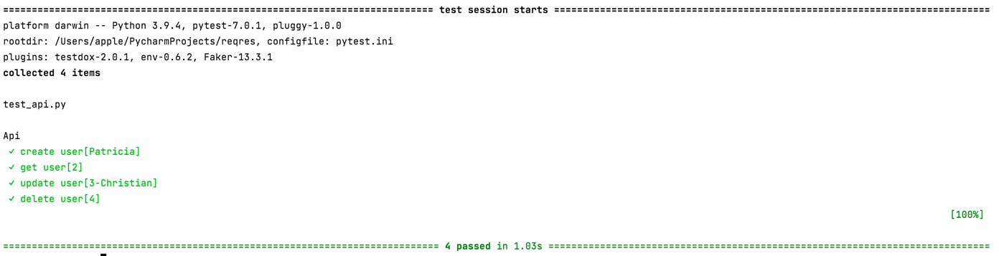

# Precondition

- [Python 3.9](https://www.python.org/)

# Installation

Install dependencies `pip install -r requirements.txt`

# Start tests

`pytest test_api.py`

# Execution results and report

